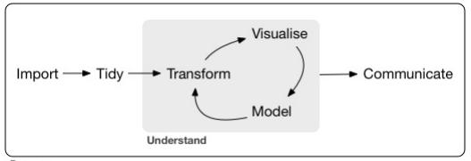

```{r setup, include=FALSE}
knitr::opts_chunk$set(echo = TRUE)
```

## Gapminder Dataset  

```{r message=FALSE}
library(gapminder)
library(ggplot2)
library(dplyr)
```



```{r}
gap <- gapminder
glimpse(gap)
```

```{r}
colnames(gap) <- c("pais", "continente", "ano", "expVida", "pop", "pibPercap")
```

```{r}
glimpse(gap)
```

```{r}
head(gap)
```

##filter
```{r}
# %>% pipe in pipe (ctrl + shif + m)
# Filtrando o dataset pelo ano de 2007
gap %>% 
  filter(ano == 2007)
```

```{r}
# Filtrando o dataset por um país
gap %>% 
  filter(pais == "Brazil")
```

```{r}
# Filtrando para duas variáveis
gap %>% 
  filter(ano == 2007, pais == "Brazil")
```

##arrange
```{r}
# arrange
# Ordenar variáveis em ordem crescente
gap %>% 
  arrange(pibPercap)
```

```{r}
# Ordenador variáveis em ordem decrescente
gap %>% 
  arrange(desc(pibPercap))
```

```{r}
# Filtrando e ordenando variáveis
gap %>% 
  filter(ano == 2007) %>% 
  arrange(desc(pibPercap))
```

##mutate
```{r}
# Alterando variáveis
gap %>% 
  mutate(pop = pop/1000000)
```

```{r}
# Adicionando nova variável
gap %>% 
  mutate(pib = pibPercap * pop)
```

```{r}
# combinando
gap %>% 
  mutate(pib = pibPercap * pop) %>% 
  filter(ano == 2007) %>% 
  arrange(desc(pib))
```

##summarize
```{r}
gap %>% 
  summarize(medExpVida = mean(expVida))
```

```{r}
gap %>% 
  filter(ano == 2007) %>% 
  summarize(medExpVida = mean(expVida))
```

```{r}
gap %>% 
  filter(ano == 2007) %>% 
  summarize(medExpVida = mean(expVida),
            totalPop = sum(as.numeric(pop)))
```

> Funções que podem ser utilizadas com summarize: mean / sum / median / min / max

##group_by
```{r}
gap %>% 
  group_by(ano) %>% 
  summarize(medExpVida = mean(expVida),
            totalPop = sum(as.numeric(pop)))
```

```{r}
gap %>% 
  filter(ano == 2007) %>% 
  group_by(continente) %>% 
  summarize(medExpVida = mean(expVida),
            totalPop = sum(as.numeric(pop)))
```

```{r}
gap %>% 
  group_by(ano, continente) %>% 
  summarize(medExpVida = mean(expVida),
            totalPop = sum(as.numeric(pop)))
```

```{r}
por_ano <- gap %>% 
  group_by(ano) %>% 
  summarize(totalPop = sum(as.numeric(pop)),
            medExpVida = mean(expVida))

por_ano
```

##ggplot
```{r}
ggplot(por_ano, aes(x = ano, y = totalPop)) +
  geom_point()
```

```{r}
ggplot(por_ano, aes(x = ano, y = totalPop)) +
  geom_point() +
  expand_limits(y = 0)
```

```{r}
por_ano_cont <- gap %>% 
  group_by(ano, continente) %>% 
  summarize(totalPop = sum(as.numeric(pop)),
            medExpVida = mean(expVida))

por_ano_cont
```

```{r}
ggplot(por_ano_cont, aes(x = ano, y = totalPop, color = continente)) +
  geom_point() +
  expand_limits(y = 0)
```

##Explorando ggplot
```{r}
gap_2007 <- gap %>% 
  filter(ano == 2007)

gap_2007
```

```{r}
ggplot(gap_2007, aes(x = pibPercap, y = expVida)) +
  geom_point()
```

*log scale*
```{r}
ggplot(gap_2007, aes(x = pibPercap, y = expVida)) +
  geom_point() +
  scale_x_log10()
```

```{r}
ggplot(gap_2007, aes(x = pibPercap, y = expVida, color = continente)) +
  geom_point() +
  scale_x_log10()
```

```{r}
ggplot(gap_2007, aes(x = pibPercap, y = expVida, color = continente, size = pop)) +
  geom_point() +
  scale_x_log10()
```

*facet*
```{r}
ggplot(gap_2007, aes(x = pibPercap, y = expVida)) +
  geom_point() +
  scale_x_log10() +
  facet_wrap(~continente)
```

```{r}
ggplot(gap_2007, aes(x = pibPercap, y = expVida, color = continente, size = pop)) +
  geom_point() +
  scale_x_log10() +
  facet_wrap(~continente)
```

*line plots*
```{r}
ggplot(por_ano_cont, aes(x = ano, y = totalPop, color = continente)) +
  geom_line() +
  expand_limits(y = 0)
```

```{r}
medExpVida_ano_continente <- gap %>% 
  group_by(ano, continente) %>% 
  summarize(medExpVida = mean(expVida))

medExpVida_ano_continente
```

```{r}
ggplot(medExpVida_ano_continente, aes(x = ano, y = medExpVida, color = continente)) +
  geom_line() +
  expand_limits(y = 0)
```

*bar plots*
```{r}
por_cont <- gap %>% 
  filter(ano == 2007) %>% 
  group_by(continente) %>% 
  summarize(medExpVida =  mean(expVida))

por_cont
```

```{r}
ggplot(por_cont, aes(x = continente, y = medExpVida)) +
  geom_col() +
  labs(title = "Expectativa de Vida Média por Continente", x = "Continente", y = "Expectativa de Vida Média")
```

*Histograma*
```{r}
ggplot(gap_2007, aes(x = expVida))+
  geom_histogram()
```

```{r}
ggplot(gap_2007, aes(x = expVida))+
  geom_histogram(binwidth = 5)
```

```{r}
ggplot(gap_2007, aes(x = continente, y = expVida))+
  geom_boxplot()
```

```{r}
gap %>% 
  filter(continente == "Americas", ano == 2007) %>% 
  filter(expVida == min(expVida))
```


