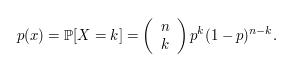
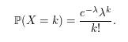
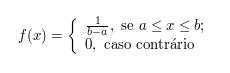
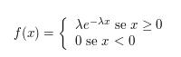
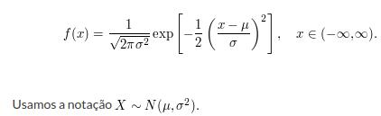

```{r setup, include=FALSE}
knitr::opts_chunk$set(echo = TRUE)
```

```{r message = F}
library(dplyr)
library(ggplot2)
```

> As funções para a função densidade / massa, função de distribuição cumulativa, função quantílica e geração de variação aleatória são nomeadas na forma dxxx, pxxx, qxxx e rxxx respectivamente.

## Distribuição Uniforme Discreta

```{r}
# install.packages("extraDistr")
library(extraDistr)
```

```{r}
# ddunif(x, min, max, log = FALSE) - função densidade / massa (fdp)
ddunif(1, 1, 6) # P(X = 1) - probabilidade de obter 1 ao lançar um dado

# pdunif(q, min, max, lower.tail = TRUE, log.p = FALSE) - função de distribuição acumulada (FDA)
pdunif(3, 1, 6) # P(X <= 3)

# qdunif(p, min, max, lower.tail = TRUE, log.p = FALSE) - retorna o quantil para uma dada probabilidade.
qdunif(.5, 1, 6) # P(X <= k) = 0.5

# rdunif(n, min, max)
rdunif(10, 1, 6) # Gera dez números aleatórios a partir de uma dist unif discreta [1, 6]
```

```{r}
x <- 1:6
y <- ddunif(x, min(x), max(x))
qplot(x, y, main = "Função Densidade de Probabilidade - Distribuição Uniforme Discreta")
```

## Distribuição Binomial
Seja $ X $ o número de sucessos obtidos na realização de $ n $ ensaios de Bernoulli independentes. Diremos que $ X $ tem distribuição binomial com parâmetros $ n $ e $ p $, em que $ p $ é a probabilidade de sucesso em cada ensaio, se sua função de probabilidade for dada por:

notação $X$ ~ $B(n, p)$

```{r}
# dbinom(x, size, prob, log = FALSE)
dbinom(2, 10, (1/6)) # P(X = 2)

# pbinom(q, size, prob, lower.tail = TRUE, log.p = FALSE)
pbinom(2, 10, (1/6)) # P(X <= 2)

# qbinom(p, size, prob, lower.tail = TRUE, log.p = FALSE)
qbinom(.90, 10, (1/6)) # P(X <= k) = 0.90

# rbinom(n, size, prob)
rbinom(15, 10, (1/6) )
```

```{r}
n <- 10
x <- 0:n
p <- 1/6
y <- dbinom(x, n, p)
qplot(x, y, main = "Função Densidade de Probabilidade - Distribuição Binomial")
```

```{r}
plot(table(rbinom(20000, 10, (1/6))))
```


## Distribuição de Poisson
Uma variável aleatória discreta $X$ segue a distribuição de Poisson com parâmetro $\lambda$, 
 $\lambda$ $>$ $0$, se sua função de probabilidade for:

notação $X \sim \ \text{Poisson}(\lambda)$ ou $X\sim \ \text{Po}(\lambda)$. O parâmetro $\lambda$ indica a taxa de ocorrência por unidade medida.

```{r}
# dpois(x, lambda, log = FALSE)
dpois(20, 15) # P(X = 20) 

# ppois(q, lambda, lower.tail = TRUE, log.p = FALSE)
ppois(20, 15) # P(X <= 20)

# qpois(p, lambda, lower.tail = TRUE, log.p = FALSE)
qpois(.1, 15) # P(X <= k) = 0.1

# rpois(n, lambda)
rpois(20, 15)
```

```{r}
lambda <- 15
x <- 0:50
y <- dpois(x, lambda)
qplot(x, y, main = "Função Densidade de Probabilidade - Distribuição de Poisson")
```

```{r}
plot(table(rpois(20000, 15)))
```

## Distribuição Uniforme Contínua
Um variável aleatória $X$ tem distribuição uniforme contínua no intervalo $[a, b]$ se a sua função densidade de probabilidade for:


```{r}
# dunif(x, min = 0, max = 1, log = FALSE)
dunif(0.45, 0, 2) # f(0.45)

# punif(q, min = 0, max = 1, lower.tail = TRUE, log.p = FALSE)
punif(.45, 0, 2) # P(X <= 0.45)

# qunif(p, min = 0, max = 1, lower.tail = TRUE, log.p = FALSE)
qunif(.9, 0, 2) # P(X <= k) = 0.9

# runif(n, min = 0, max = 1)
runif(20, 0, 2)
```

```{r}
x <- seq(0, 2)
y <- dunif(x,min(x), max(x))
qplot(x, y, main = "Função Densidade de Probabilidade - Distribuição Uniforme", geom = "line")
```

## Distribuição Exponencial

*Função Densidade de Probabilidade*

onde $\lambda > 0$  
Notação $X$ ~ $Exp(\lambda)$

```{r}
# dexp(x, rate = 1, log = FALSE)
dexp(2, 1/15) # f(2)

# pexp(q, rate = 1, lower.tail = TRUE, log.p = FALSE)
pexp(2,1/15) # P(X <= 2)

# qexp(p, rate = 1, lower.tail = TRUE, log.p = FALSE)
qexp(0.1248267, 1/15) # P(X <= k) = 0.1248267

# rexp(n, rate = 1)
rexp(20, 1/15)
```

```{r}
x <- seq(0, 100)
qplot(x, dexp(x,1/15), geom = "line", main = "Função Densidade de Probabilidade - Distribuição Exponencial")
```

## Distribuição Normal

*Função Densidade de Probabilidade*



```{r}
# dnorm(x, mean = 0, sd = 1, log = FALSE)
dnorm(99,100,10) # f(99)

# pnorm(q, mean = 0, sd = 1, lower.tail = TRUE, log.p = FALSE)
pnorm(99,100,10) # P(X <= 99)

# qnorm(p, mean = 0, sd = 1, lower.tail = TRUE, log.p = FALSE)
qnorm(0.4601722, 100, 10) # P(X <= k) = 0.4601722

# rnorm(n, mean = 0, sd = 1)
rnorm(20, 100, 10)
```

```{r}
x <- seq(50, 150)
qplot(x, dnorm(x,100,10), geom = "line", main = "Função Densidade de Probabilidade - Distribuição Normal")
```

```{r}
x <- seq(50,150)
m100_dp10 <- dnorm(x, 100, 10)
m90_dp10 <- dnorm(x, 90, 10)
m110_dp10 <- dnorm(x, 110, 10)

df <- data.frame(x, m100_dp10, m90_dp10, m110_dp10)

ggplot(df) +
  geom_line(aes(x, m100_dp10, color = "m100_dp10")) +
  geom_line(aes(x, m90_dp10, color = "m90_dp10")) +
  geom_line(aes(x, m110_dp10, color = "m110_dp10")) +
  ggtitle("Efeito da Média sobre a Distribuição Normal") +
  ylab("f(x)") +
  labs(color = "Curvas")
```

```{r}
x <- seq(50,150)
m100_dp10 <- dnorm(x, 100, 10)
m100_dp8 <- dnorm(x, 100, 8)
m100_dp12 <- dnorm(x, 100, 12)

df <- data.frame(x, m100_dp10, m100_dp8, m100_dp12)

ggplot(df) +
  geom_line(aes(x, m100_dp10, color = "m100_dp10")) +
  geom_line(aes(x, m100_dp8, color = "m100_dp8")) +
  geom_line(aes(x, m100_dp12, color = "m100_dp12")) +
  ggtitle("Efeito do Desvio-Padrão sobre a Distribuição Normal") +
  ylab("f(x)") +
  labs(color = "Curvas")
```


