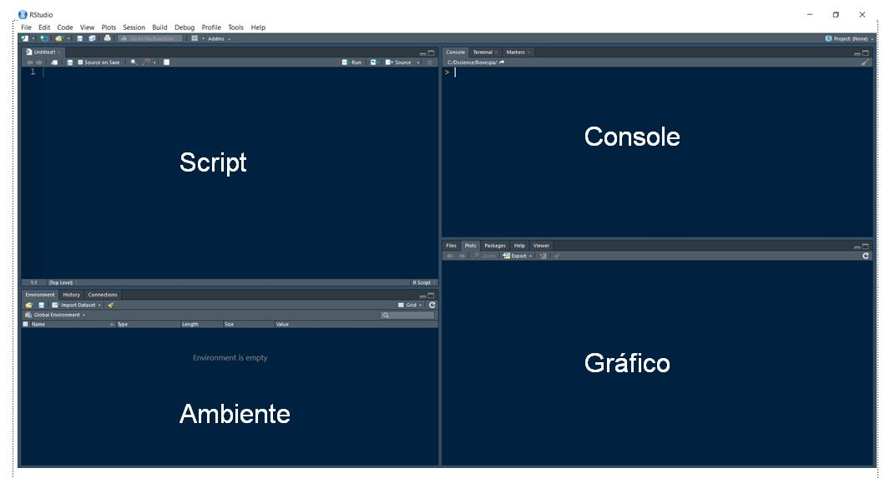

```{r setup, include=FALSE}
knitr::opts_chunk$set(echo = TRUE)
```

## Instalando o R  

* R (*open source*) está diponível em CRAN [http://cran.r-project.org/](http://cran.r-project.org/)  
* Recomendo o uso do IDE (*Integrated Development Environment *) RStudio (*open source*) [http://www.rstudio.com](http://www.rstudio.com)  
* Quando o RStudio é iniciado, ele inicia o R juntamente com ele. A inicialização do RStudio é feita de maneira consistente com outros aplicativos para o seu sistema operacional.  

 
## Definindo o Diretório de Trabalho

```{r}
# setwd("D://FAESA/Modelos/script_aulas") #usb
setwd("~/R/RProjects/R_aulas/Estatistica_R") #notebook
```

```{r}
getwd()
```

Recomendo armazenar todos os seus arquivos de trabalho nesse diretório para ganho de produtividade.

## Aritmética com R 
* Adição: `+`
* Subtração: `-`  
* Multiplicação: `*`  
* Divisão: `/`  
* Exponenciação: `^` ou `**`  
* Módulo: `%%`

```{r}
2 + 2 # adição
```

```{r}
2 ^ 4 # exponenciação
```

```{r}
2 ** 4 # exponenciação
```

## Tipos básicos de dados com R  
* Classes básicas (ou atômicas) de objetos:**
* Valores decimais como `4.5` são os do tipo `double` (numérico)    
* Números inteiros como `5L` são os do tipo `integer` (numérico inteiro)  
* Números complexos como `2+3i` são os do tipo `complex` (complexo)  
* Valores booleanos (`TRUE` e `FALSE`) são os do tipo `logical` (lógico)  
* Textos (ou *strings*) são os do tipo `character` (caracter) 

```{r}
a <- 23.5
b <- 5
c <- 5L
d <- "adriano"
```

```{r}
typeof(a)
```

```{r}
typeof(b)
```

```{r}
typeof(c)
```

```{r}
typeof(d)
```

**As classes podem ser verificadas em R através:**

```{r}
teste <- list(23.5, 5, 5L, 2+3i, TRUE, "adriano")
sapply(teste,typeof) 
```

## Operadores relacionais

**Operador de designação:** `<-`(preferencialmente) ou `=` 
**Atalho:** `Alt` + `-` 

```{r}
a <- 8
b <- 9
```

```{r}
a > 8
a < 8
a <= 8
a >= 8
a == 8
a != 8
```

## Operadores lógicos
### And (e)

```{r}
(a==8) & (b==6)
(a==7) & (b==5)
(a==8) & (b==9)
```

### Or (ou)

```{r}
(a==8) | (b>5)
(a==8) | (b>=10)
(b >= 10) | (a ==8)
```

### Not

```{r}
a > 8
print(!a > 8)
```

## Atribuindo valores a objetos

> Atenção: as variáveis em R são sensíveis ao fato de serem caixa alta ou não. Por exemplo, XYZ, xyz, xYz, são variáveis diferentes em R.

Uma das funções mais comumente usadas em R tem o nome abreviado `c`. Esta função é usada para combinar valores. Aqui nós combinamos vários números e os atribuímos à variável x:

```{r}
dado <- c(1.86, 1.83, 1.7, 1.69, 1.84, 1.77)
dado
```

```{r}
print(dado)
```

## Verificando posições no R

```{r}
dado[3]
```

```{r}
dado[1:3]
```

```{r}
dado[-1]
```

```{r}
length(dado)
```

## Funções

```{r}
x <- pi
sin(x)
sqrt(x)
round(sqrt(x), 2)
```

As funções são chamadas pelo nome seguido por um par de parênteses. Se houver mais de um argumento, o que geralmente é o caso, eles serão separados por vírgulas. Um exemplo disso seria a função logarítmica que tem um argumento opcional para a base:

```{r}
log(x) # log na base e = exp(1)
log(x, 10) # log na base 10
```

## Funções Vetorizadas

R tem várias funções que fazem a mesma coisa para cada número. São as funções vetorizadas.

```{r }
dado + dado
sqrt (dado)
dado - sqrt(dado)
```

## Ajuda em R - *Help*

Como acessar a documentação da função em R:
```{r eval = FALSE}
?mean
```

Funções úteis para acessar documentação em R:

```{r}
apropos("mean") # lista objetos que tem a string mean
```

```{r eval = FALSE}
help("mean") # o mesmo resultado de ?mean 
```

```{r}
example("mean") # roda exemplos encontrados na página do help
```

```{r eval = FALSE}
help(package="MASS") # lista informações acerca de um package (pacote)
```

## Área de Trabalho - Workspace

Lista das variáveis ativas no workspace:
```{r}
ls()
```

Remover uma única variável da workspace:
```{r}
rm(x)
```

Remover todas as variáveis da workspace:
```{r}
rm(list = ls())
```

## Pacotes Externos - External Packages

Instalando um pacote - basta uma única vez:
```{r eval = FALSE}
install.packages("UsingR")
```

Em cada sessão:
```{r message = FALSE}
library(UsingR)
```

Datasets presentes no pacote:
```{r eval = FALSE}
data(package="UsingR")
```


